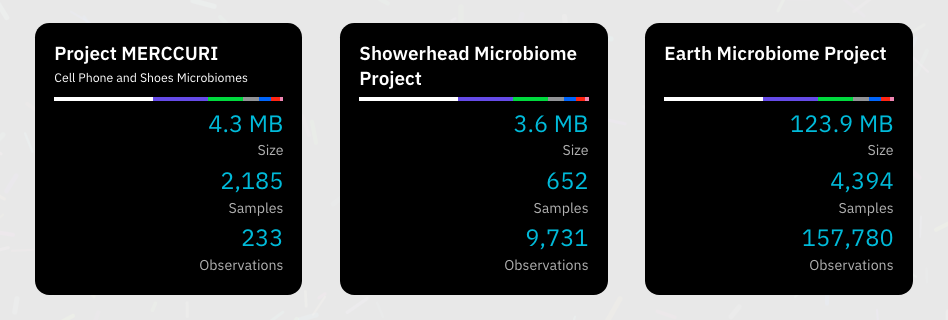

Flagship Datasets
=================

[Phinch](https://github.com/PhinchApp/Phinch) is a data visualization framework aimed at promoting novel explorations of large biological datasets. 

We've collected these 3 flagship datasets for new users to try out Phinch's capabilities:

Project MERCCURI
----------------

### Cell Phone and Shoe Microbiomes

Filename: `ps10.biomlike.2-edited-HDF5-metadata.biom`

Are there differences between the microbes on people’s shoes on the East Coast versus the West Coast? Between basketball fan cell phones and football fan cell phones? This study collected 2500 swab samples at sporting events, space meetups, and other public events across the USA to answer these kinds of questions. Microbes were sampled from participants' cell phones and shoes from at these events.

Project Website: https://spacemicrobes.org

Showerhead Microbiome Project
-----------------------------

Filename: `showerhead_unoise_16S_otu_table_wTax_noChloroMito_nodust_nocntrls_2000+reads_March2018_vfinal-JSON-Metadata.txt`

What do microbial communities on household showerheads look like around the world? The Showerhead Microbiome Project worked with citizen scientists to collect showerhead biofilm samples and associated water chemistry data from 656 households located across the United States and Europe. This recently published study found that water source, water chemistry, and household location influenced the prevalence of specific mycobacterial lineages detected in showerheads.

Project Website: http://robdunnlab.com/projects/showerheads/
Journal Article: https://mbio.asm.org/content/9/5/e01614-18

Earth Microbiome Project
------------------------

### Subset of Samples

Filename: `emp_deblur_150bp.subset_10k.rare_5000-metadata.biom`

The Earth Microbiome Project (EMP) is a massively collaborative effort to characterize microbial life on this planet, using DNA sequencing of crowd-sourced samples to understand patterns in microbial ecology across the biomes and habitats of our planet. The EMP is a comprehensive example of open science, leveraging a collaborative network of 500+ investigators, supporting pre-publication data sharing, and crowdsourcing data analysis to enable universal principles to be explored. 

Project Website: http://earthmicrobiome.org/
Journal Article: https://www.nature.com/articles/nature24621
